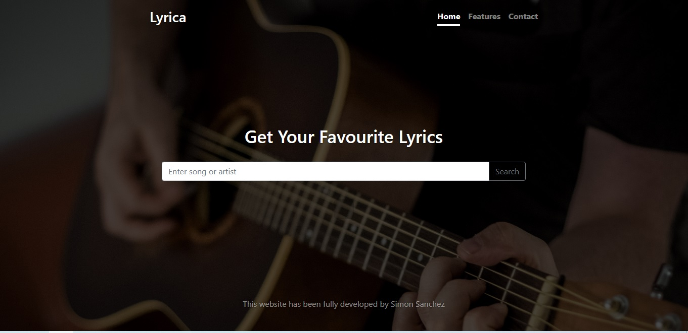
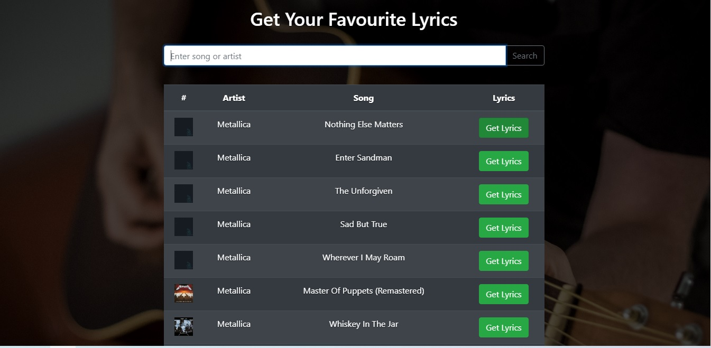
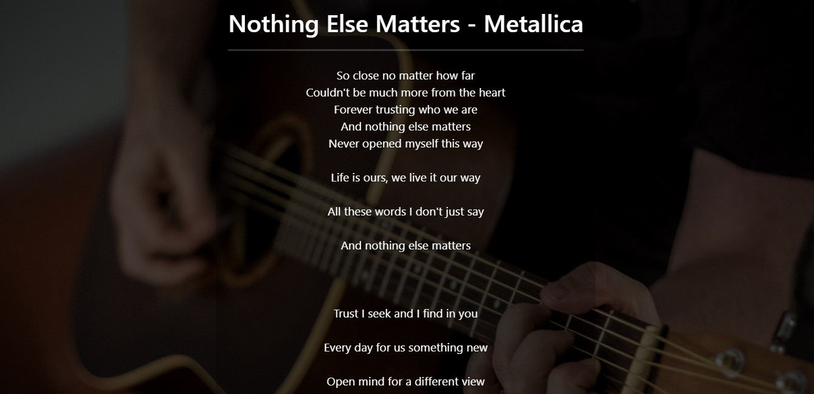
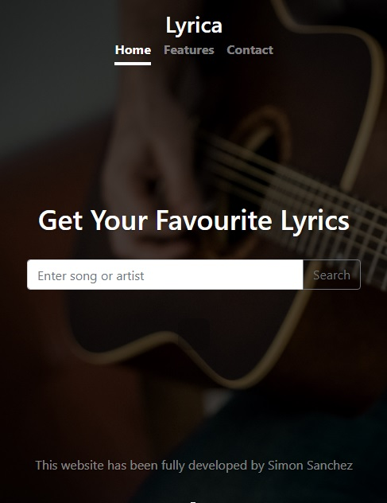
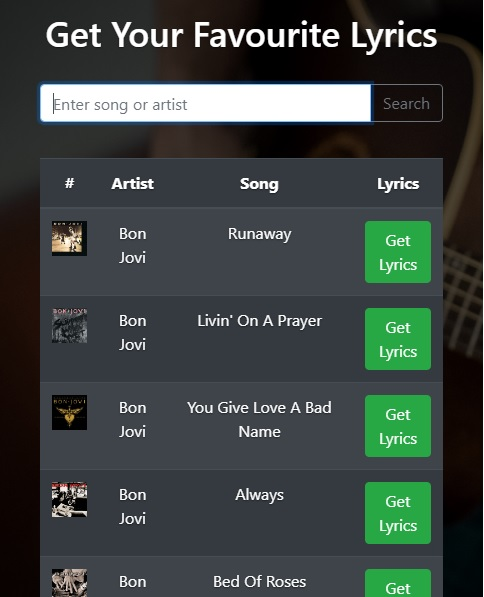
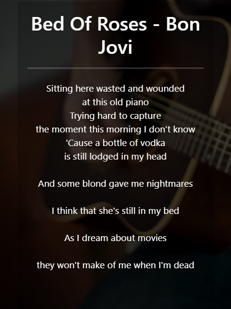

# song-lyric-searcher

Lyric searcher web application built with HTML, CSS, Bootstrap, and vanilla JavaScript

The app fetches queries by the user from the <b>lyrics.ovh API</b>

<h3>Implemented Technologies:</h3>
<ul>
<li>HTML5</li>
<li>CSS3</li>
<li>Bootstrap</li>
<li>Vanilla JavaScript</li>
</ul>

#Images:
 
 
 
 
 
 
